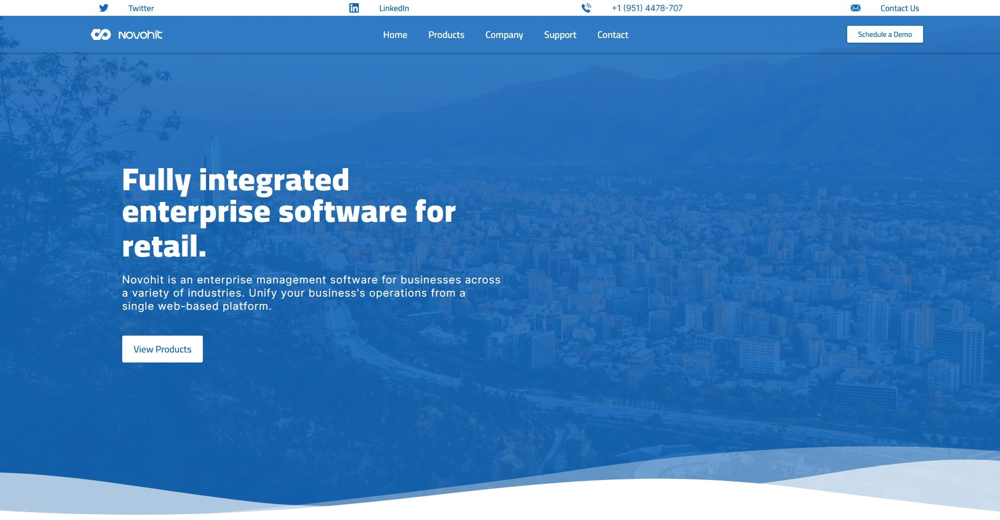
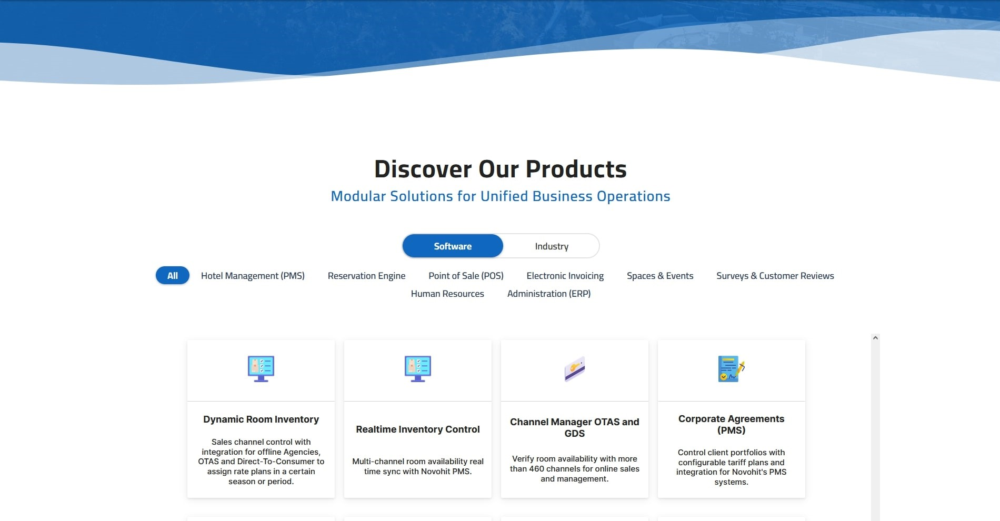
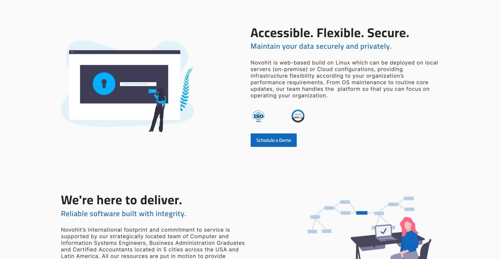
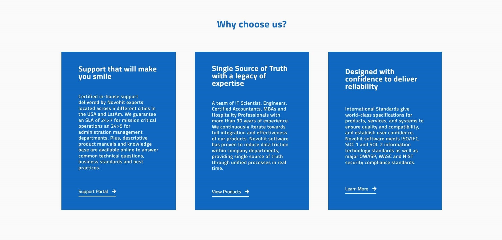
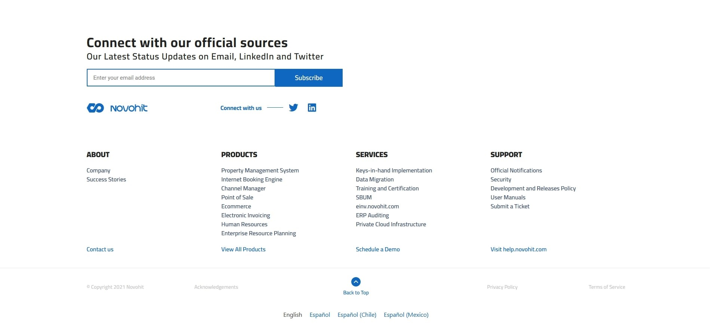
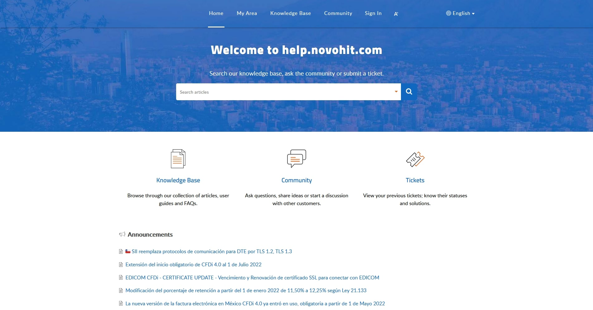
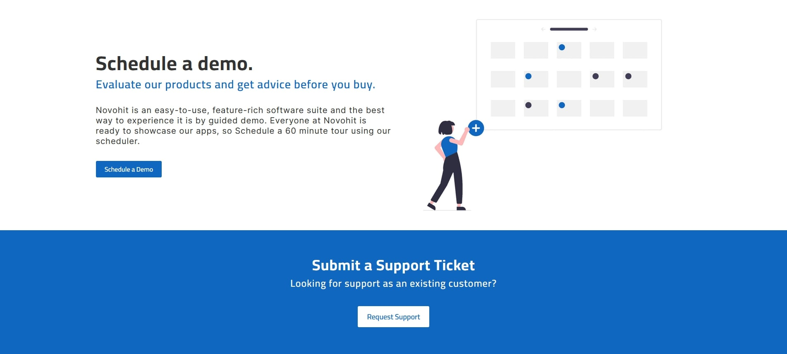

<!-- Heading -->
<section>
    

        
        <h1>Novohit Website Redesign</h1>
        
A single-page website designed for Novohit using WordPress and Elementor.

    

    

        <a href='#live-demo'>Live Demo</a> •
        <a href='#overview'>Overview</a> •
        <a href='#features'>Features</a> •
        <a href='#technologies-used'>Technologies Used</a> •
        <a href='#screenshots'>Screenshots</a> •
        <a href='#problem-solving'>Problem Solving</a> •
        <a href='#code-examples'>Code Examples</a> •
        <a href='#future-improvements'>Future Improvements</a>
    

</section>

<!-- Live Demo -->

<h3 id="live-demo">🔍 Live Demo</h3>

<a href="https://www.novohit.com/" target="_blank">https://www.novohit.com/</a>

<!-- Overview -->

<h3 id="overview">📋 Overview</h3>

Novohit is an enterprise software management company developing Enterprise Resource Planning (ERP) solutions for a variety of businesses in the hospitality industry. Located in Santiago, Chile, the company contracted me to redesign their outdated website, align incoming brand changes with existing products, and help build a foundation to enter into the U.S. market.

<!-- Features -->

<h3 id="features">✨ Features</h3>

-   Automatic and manual language localization to serve pages to American, Mexican, and Chilean audiences
-   Responsive styling for mobile, tablet, and desktop
-   Product catalog with optional filtering
-   Client scheduling system for in-person or virtual demos

<!-- Technologies -->

<h3 id="technologies-used">🧰 Technologies Used</h3>

     

<!-- Screenshots -->

<h3 id="screenshots">👀 Screenshots</h3>

#### Landing Page

#### Product Catalog

#### Company Services

#### Company Values

#### Footer

#### Support Page

#### Contact Page

<!-- Problem Solving -->

<h3 id="problem-solving">🚧 Problem Solving</h3>

#### Styling Conventions

This project was my first exposure to using **[WindiCSS](https://windicss.org/guide/)** (an on-demand alternative to **[Tailwind](https://tailwindcss.com/docs/utility-first)**). Although Windi is convenient for styling elements on the fly, it suffers from the same issues as Tailwind: lack of legibility, inability to chain selectors, cluttering the DOM, etc. I realized the need for a consistent naming scheme after styling my first few React components and began researching a flexible solution.

After looking into the issue, I discovered a CSS naming convention created by BEM for writing cleaner and more readable class names. You can read up on the methodology with examples in **[BEM's official guide](http://getbem.com/introduction/)**. These practices provided me with solutions for simplifying the DOM structure, creating descriptive CSS styles, and self-documenting my code.

Reading up on the Windi documentation allowed me to **[incorporate Windi's utility classes in an external stylesheet](#styling-conventions-1)** and preserve my application's class naming schemes. Even though this method would invalidate one of the framework's biggest advantages, I was able to reduce the clutter of my JSX files and create a solution with BEM conventions in mind.

#### Custom Tooltips

Since React is a very flexible library, many developers turn to third-party solutions when it comes to certain features. For example, some components on Google's search page provide users with tooltips on hover and I needed a way to incorporate this functionality into my project.

**[React Tooltip](https://github.com/wwayne/react-tooltip)** is a library with almost 3k stars on GitHub. Many developers rely on external solutions such as this one assuming the library will be well maintained and up-to-date. Unfortunately, myself and many others were running into **[compatibility issues between React Tooltip and React 18](https://github.com/wwayne/react-tooltip/issues/777)**. The repository had been struggling to find a maintainer and likely wouldn't be updated for the new version of React anytime soon.

I decided to create **[a simple, reusable tooltip system](#custom-tooltips-1)** that complimented my project instead of relying on the inconsistencies of an external library. This solution was lightweight and allowed me to wrap icons within my `<Tooltip />` component and create custom tooltip styles.

#### Data Fetching

For this application, we only need to service GET requests from the API. Fetching data in React is fairly straightforward using Async/Await and Axios (see **[Data Fetching code snippet](#data-fetching-1)**). The real challenge is distributing the returned data across a React project between parent and child components. To overcome this obstacle we can use **[React Context](#react-context)**.

#### React Context

The React Context API was introduced in React v16.3, allowing developers to pass data through component trees and share information at various levels in an application. Instead of passing props down through every single component on the tree, the components that require a prop can simply request it from `useContext()`. This feature circumvents the dreaded practice of **[prop drilling](https://blog.logrocket.com/react-context-api-deep-dive-examples/#reactpropdrilling)** and reduces unnecessary re-rendering.

To use Context within our application we first establish a State Provider, essentially a higher order component that passes values to it's `{children}`, to use state within our application. Feel free to **[view my implementation of StateContext here](#react-context-1)** for a better understanding. You might notice that my code includes an additional implementation `useReducer()` which is an alternative to `useState()` and is used when the next state depends on the previous one. This allows us to implement features such as comparing form inputs or **[toggling themes](#theme-switcher)**.

#### Reducer

I used **[React's reducer hook](https://reactjs.org/docs/hooks-reference.html#usereducer)** in conjunction with React Context to reference search inputs and the application's current theme. `useReducer()` works exactly like JavaScript's Array `reduce()` function by receiving an initial value of `state` and an `action`, and then returning a new state. I created two `actionTypes` within my application, `SET_SEARCH_INPUT` and `SET_APPLICATION_THEME`, to pass input and theme values to various components (see **[Reducer](#reducer-1)** code snippet).

#### Data Rendering

Data is rendered to the virtual DOM by **[mapping over results](#data-rendering-1)** fetched from the GET method in `useSearch.js`.

#### Theme Switching

React Context makes it easy to receive, mutate, and pass the global state value of `theme` to any component. In this **[example with the application's theme switching feature](#theme-switching-1)**, I use the `theme` state to conditionally render icons and toggle between styles pertaining to light and dark mode.

#### Parsing Search Input

Search engines are built with varying degrees of complexity to allow for detailed queries. Most users take advantage of basic keyword searching so I decided to implement **[a regex pattern that combines words and filters special characters](#parsing-search-input-1)**.

For example, searching `cat memes` or `cat!@#$%-_memes` is parsed to `cat+memes` which is the appropriate format for Google's search engine parameters. The resulting URL becomes `https://google-search3.p.rapidapi.com/api/v1/search/q=cat+memes&num=10`.

#### Continuous Integration

This project was my first exposure to **[GitHub Actions](https://docs.github.com/en/actions)**. After reading about the benefits of continuous integration and development, I decided to create **[a workflow that would build and deploy my project](#continuous-integration-1)** to GitHub Pages automatically.

#### Webpack Configuration

A neat trick I learned throughout the development of this project is using Webpack aliases to create shortened file references. This is extremely helpful for avoiding long and repetitive path names such as `import ModuleName from '../../../src/components/Component`. See the **[Webpack Configuration](#webpack-configuration-1)** code snippet for more details.

<!-- Code Examples -->

<h3 id="code-examples">📸 Code Examples</h3>

#### Styling Conventions

#### Custom Tooltips

#### Data Fetching

#### React Context

#### Reducer

#### Data Rendering

#### Theme Switching

#### Parsing Search Input

#### Continuous Integration

#### Webpack Configuration

<!-- Improvements -->

<h3 id="future-improvements">🧪 Future Improvements</h3>

-   **[Pagination](https://www.educba.com/pagination-in-javascript/)**
-   "I'm Feeling Lucky" button takes the user to a random page
-   Sorting results into sections (i.e. All, Images, News, etc.)
