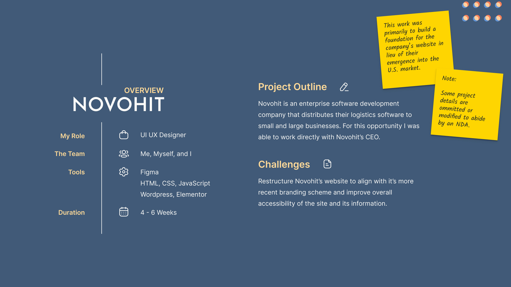
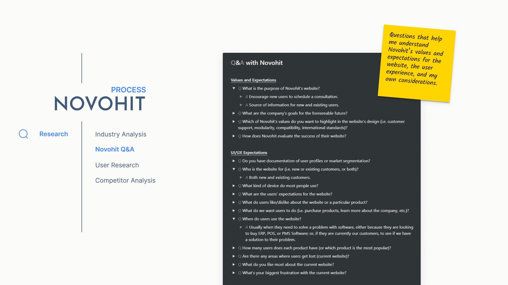
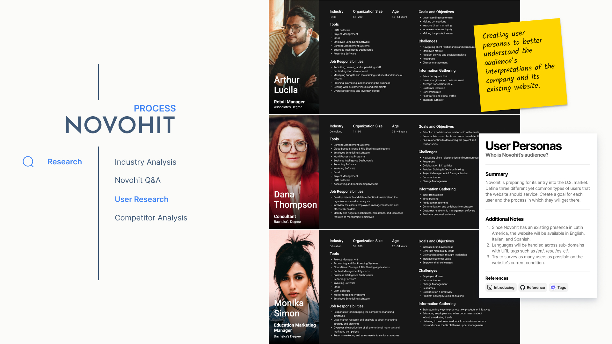
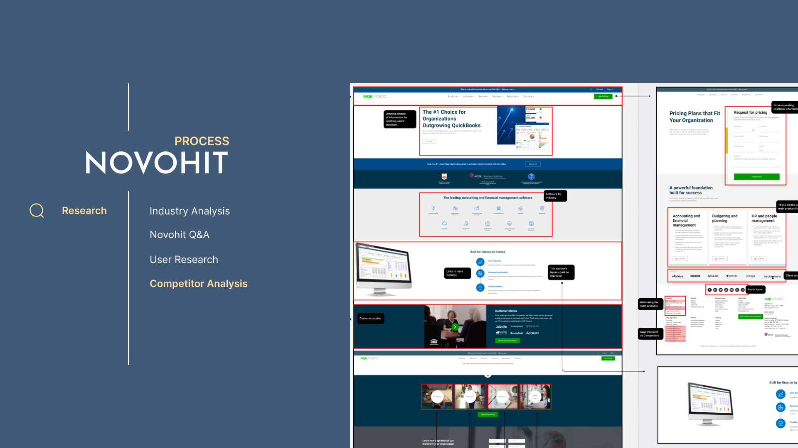
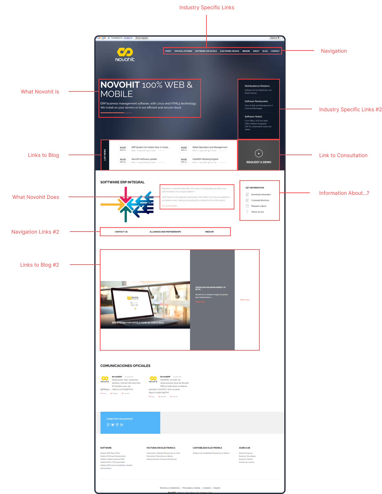
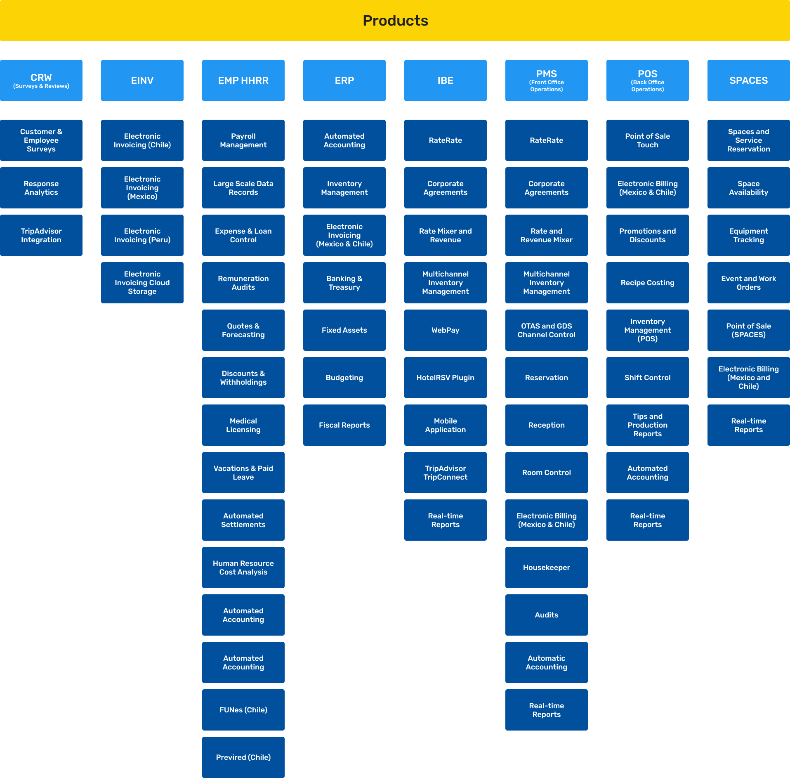
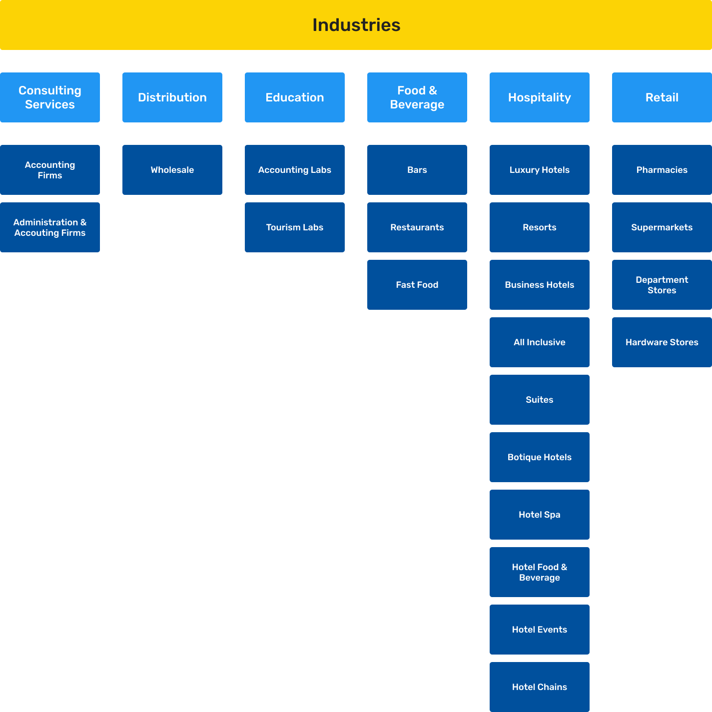

<!-- Heading -->
<section>
    

        
        <h1>Novohit Website Redesign</h1>
        
A single-page website designed for Novohit using WordPress and Elementor.

    

    

        <a href='#live-demo'>Live Demo</a> •
        <a href='#overview'>Overview</a> •
        <a href='#features'>Features</a> •
        <a href='#technologies-used'>Technologies Used</a> •
        <a href='#screenshots'>Screenshots</a> •
         
        <a href='#research'>Research</a> •
        <a href='#plan'>Plan</a> •
        <a href='#create'>Create</a> •
         
        <a href='#code-examples'>Code Examples</a> •
        <a href='#additional-information'>Additional Information</a>
    

</section>

<!-- Live Demo -->

<h3 id="live-demo">🔍 Live Demo</h3>

<a href="https://www.novohit.com/" target="_blank">https://www.novohit.com/</a>

<!-- Overview -->

<h3 id="overview">📋 Overview</h3>

Novohit is an enterprise software management company developing Enterprise Resource Planning (ERP) solutions for a variety of businesses in the hospitality industry. Located in Santiago, Chile, the company contracted me to redesign their outdated website, align incoming brand changes with existing products, and help build a foundation for their entry into the U.S. market.

<!-- Features -->

<h3 id="features">✨ Features</h3>

-   Automatic and manual language localization to serve pages to American, Mexican, and Chilean audiences
-   Responsive styling for mobile, tablet, and desktop
-   Product catalog with optional filtering
-   Client scheduling system for in-person or virtual demos

<!-- Technologies -->

<h3 id="technologies-used">🧰 Technologies Used</h3>

     

<!-- Screenshots -->

<h3 id="screenshots">👀 Screenshots</h3>

#### Landing Page

#### Product Catalog

#### Company Services

#### Company Values

#### Footer

#### Support Page

#### Contact Page

<!-- Problem Solving -->

<h3 id="research">🔬 Research</h3>

#### Industry Analysis

Since this was my first experience delving into the business space of ERP systems, I wanted to do preliminary research before having an in-depth conversation with Novohit. Approaching the situation with pre-existing knowledge would help myself and the client set realistic expectations going forward.

I spent a week familiarizing myself with the **who**, the **what**, and the **why** of enterprise systems.

-   **Who** is it designed for?
-   **What** is ERP?
-   **Why** do companies use it? etc.

#### Novohit Q&A

Following my initial research, I prepared a Q&A discussion with Novohit to:

-   define the project's timeline
-   generate ideas for the website's design and user experience
-   learn more about the company's product and target audience

This was an introspective exercise to help me understand Novohit's vision and resolve future concerns in hindsight.

#### User Research (Surveys)

The previously mentioned Q&A only revealed a partial understanding of Novohit's expectations as a company. I needed more feedback from customers and users themselves to understand how the company's audience felt about their website.

Working with limited resources, I drafted a Google Survey that introduced respondees to **[Novohit's old website](#sitemap-novohit-old)** and asked them to answer a series of questions regarding their initial impressions.

#### User Research (Personas)

I continued my research by drafting personas from the information in my initial Q&A with Novohit. While the portraits in the below image are fictional, the information represented in each card is indicative of Novohit's existing clientele and incoming customers from the U.S.

#### Competitor Analysis

The final step in my research process was a simple competitive analysis of existing ERP developers to see how others solve similar problems. My challenge was to create or adopt a solution for managing the plethora of information that hindered Novohit's antiquated website navigation. The company wanted a more fundamental method for organizing and presenting information to new and existing customers which we solved with a single-page application.

The below image represents my competitor research and includes observations about other sites' user interfaces and experience.

<!-- plan -->

<h3 id="plan">📅 Plan</h3>

Following the project's research phase, it was time to focus on user experience. My initial introspection with Novohit helped to identify two key objectives that influenced the proposal pictured below — to be accessibile and approachable.

Novohit wanted more customer outreach to users on tablets and mobile phones, as well as a design that would assist new customers with finding a product for their specific use case. This would assure existing clients could find the information they need while helping new clients identify useful services that Novohit provides.

<!-- create -->

<h3 id="create">✏️ Create</h3>

<!-- Code Examples -->

<h3 id="code-examples">📸 Code Examples</h3>

#### Subheading

<!-- Additional Information -->

<h3 id="additional-information">🔖 Additional Information</h3>

<h4 id="sitemap-novohit-old">Novohit Sitemap (Old)</h4>

Preview of Novohit's old website.

.png>)

<h4 id="sitemap-novohit-new">Novohit Sitemap (New)</h4>

Preview of a proposed sitemap revision.

<h4>Novohit Landing Page (Old)</h4>

Preview of Novohit's previous landing page.

<h4>Novohit Services</h4>

Card diagram of Novohit's services.

<h4>Novohit Industries</h4>

Card diagram of Novohit's clientele by industry.

