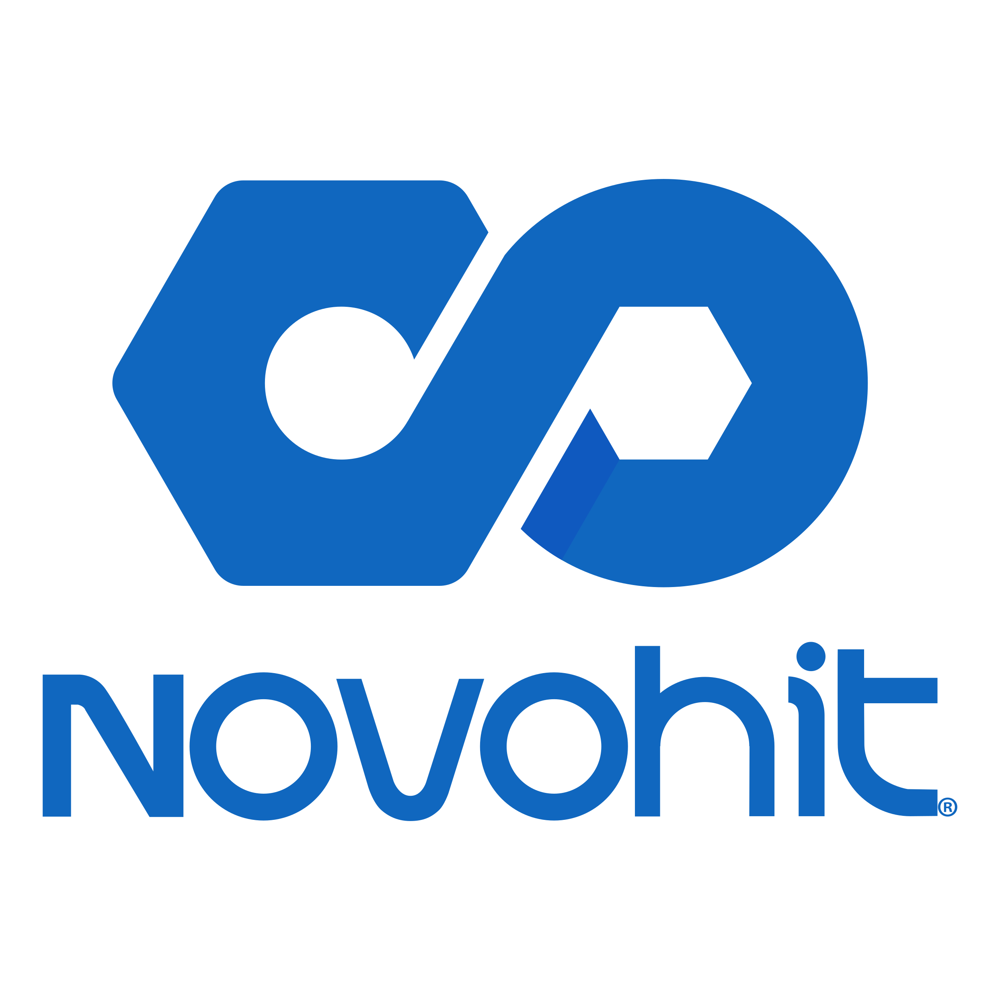
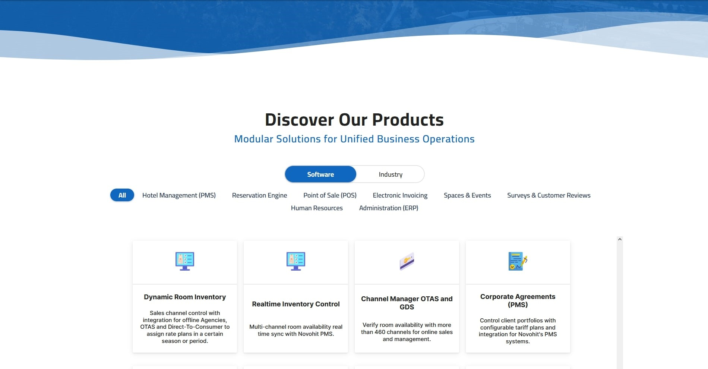
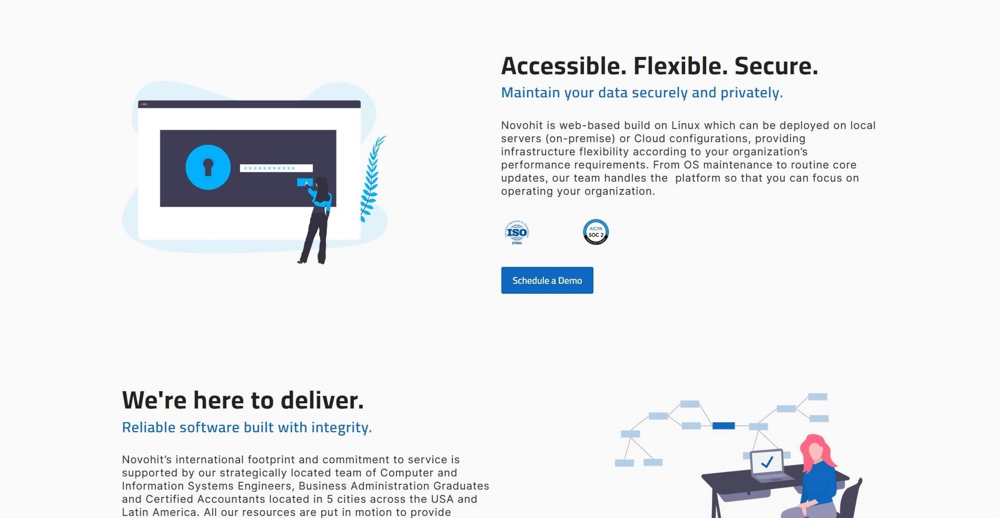
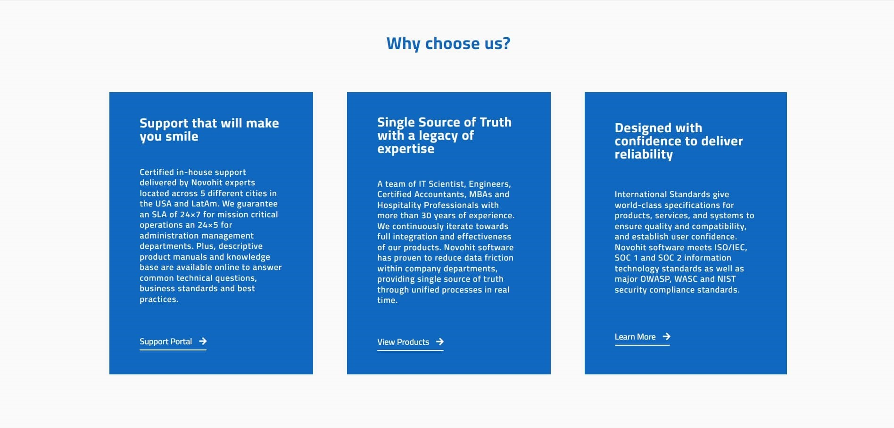
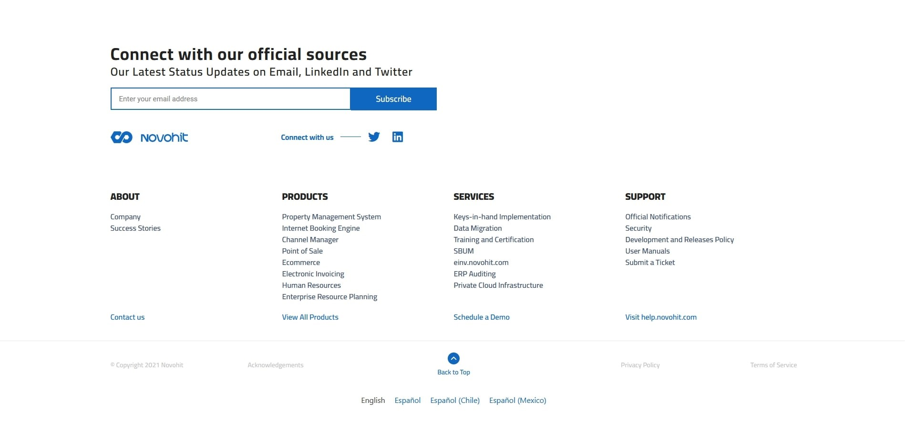
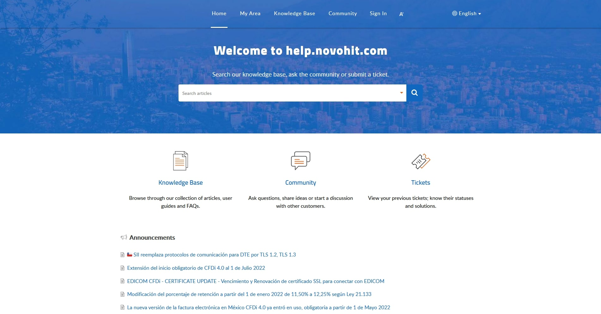
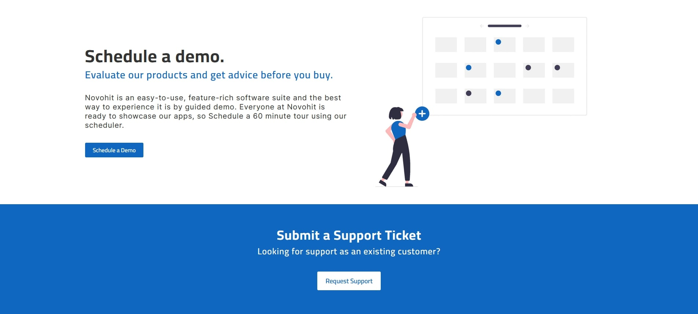
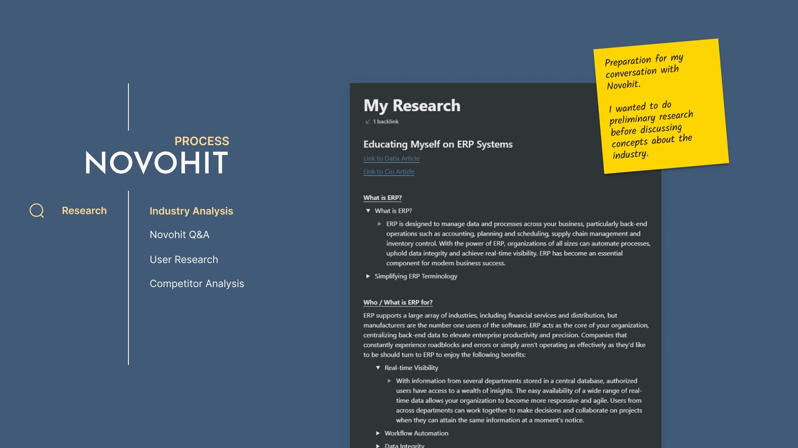
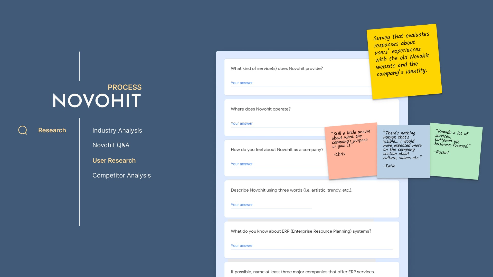
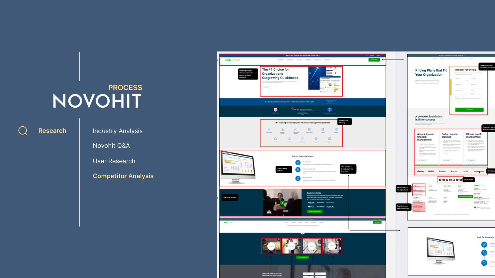

<!-- Heading -->

<h1>Novohit Website Redesign</h1>

A single-page website designed for Novohit using WordPress and Elementor.

<!-- Table of Contents -->

<ul>
    <li><a href="#live-demo">Live Demo</a></li>
    <li><a href="#overview">Overview</a></li>
    <li><a href="#features">Features</a></li>
    <li><a href="#outcomes">Outcomes</a></li>
    <li><a href="#technologies-used">Technologies Used</a></li>
    <li>
        <a href="#screenshots">Screenshots</a>
        <ul>
            <li><a href="#landing-page">Landing Page</a></li>
            <li><a href="#product-catalog">Product Catalog</a></li>
            <li><a href="#company-services">Company Services</a></li>
            <li><a href="#company-values">Company Values</a></li>
            <li><a href="#footer">Footer</a></li>
            <li><a href="#support-page">Support Page</a></li>
            <li><a href="#contact-page">Contact Page</a></li>
        </ul>
    </li>
    <li>
        <a href="#design-process">Design Process</a>
        <ul>
            <li><a href="#research">Research</a></li>
            <ul>
                <li><a href="#industry-analysis">Industry Analysis</a></li>
                <li><a href="#novohit-q-and-a">Novohit Q&A</a></li>
            </ul>
            <li><a href="#plan">Plan</a></li>
            <li><a href="#design">Design</a></li>
        </ul>
    </li>
    <li>
        <a href="#additional-information">Additional Information</a>
        <ul>
            <li><a href="#code-examples">Code Snippets</a></li>
        </ul>
    </li>
</ul>

<!-- Live Demo -->

<h3 id="live-demo">🔍 Live Demo</h3>

<a href="https://www.novohit.com/" target="_blank">https://www.novohit.com/</a>

<!-- Overview -->

<h3 id="overview">📋 Overview</h3>

Novohit is a software management company developing Enterprise Resource Planning (ERP) solutions for a variety of businesses in the hospitality industry. Located in Santiago, Chile, the company contracted me to redesign their outdated website, align incoming brand changes with existing products, and help build a foundation for their entry into the United States market.

<!-- Features -->

<h3 id="features">✨ Features</h3>

<ul>
    <li>Automatic and manual language localization to serve pages to American, Mexican, and Chilean audiences</li>
    <li>Responsive styling for mobile, tablet, and desktop</li>
    <li>Product catalog with optional filtering</li>
    <li>Client scheduling system for in-person or virtual demos</li>
</ul>

<!-- Outcomes -->

<h3 id="Outcomes">📊 Outcomes</h3>

<ul>
    <li>Increased page impressions by +2,000/month and implemented website translation services for thousands of monthly visitors</li>
    <li>Designed modern accessibility features for 3,500 monthly mobile, tablet, and desktop users</li>
    <li>Leveraged Figma to create a scalable design system for Novohit’s website</li>
</ul>

<!-- Technologies -->

<h3 id="technologies-used">🧰 Technologies Used</h3>

<!-- Screenshots -->

<h3 id="screenshots">🖥️ Screenshots</h3>

<h4 id="landing-page">Landing Page</h4>

<h4 id="product-catalog">Product Catalog</h4>

<h4 id="company-services">Company Services</h4>

<h4 id="company-values">Company Values</h4>

<h4 id="footer">Footer</h4>

<h4 id="support-page">Support Page</h4>

<h4 id="contact-page">Contact Page</h4>

<!-- Design Process -->

<h3 id="design-process">🧰 Design Process</h3>

<!-- Research -->

<h4 id="research">🔬 Research</h3>

<!-- Industry Analysis -->

<h5 id="industry-analysis">Industry Analysis</h5>

Since this was my first opportunity exploring the business space of ERP systems, I decided to do preliminary research before having an in-depth conversation with Novohit. Approaching the situation with pre-existing knowledge would create realistic expectations for the client and I moving forward.

I spent a week familiarizing myself with the <b>who</b>, the <b>what</b>, and the <b>why</b> of enterprise systems.

<ul>
    <li><b>Who</b> is it designed for?</li>
    <li><b>What</b> is ERP?</li>
    <li><b>Why</b> do companies use it? etc.</li>
</ul>

This information was pivotal during live discussions with Novohit's CEO regarding the design and user experience of their new website. Becoming well-versed in the company's roles, responsibilities, values, and expectations had helped me create a more meaningful experience for Novohit and its customers, and allowed me to embody professionalism as a UI/UX Developer.

<!-- Novohit Q&A -->

<h5 id="novohit-q-and-a">Novohit Q&A</h5>

Following my initial research, I prepared a Q&A discussion with Novohit to:

<ul>
    <li>Define the project's timeline</li>
    <li>Generate ideas for the website's design and user experience</li>
    <li>Learn more about the company's product and target audience</li>
</ul>

This was an introspective exercise to help me understand Novohit's vision and resolve future concerns in hindsight. My primary concern was feature creep and I wanted to define a set of guidelines before getting started. While there were many decisions made during the development phase, I created a future-proof system to coordinate with any priority shifts or newly generated ideas.

For example, midway through the design phase of Novohit's product page, I was asked to align the company's assets with their recently updated branding scheme. At the time, I leveraged Figma as my design program of choice and was learning how to create scalable design systems while applying these practices during the project's development. I was able to apply variations and change global styles to update the existing designs in just a few clicks, instead of having to comb through every custom component and update styles individually.

<!-- User Research (Surveys) -->

<h5 id="user-research-surveys">User Research (Surveys)</h5>

The previously mentioned Q&A only revealed a partial understanding of Novohit's expectations as a company. I needed more feedback from customers and users themselves to understand how the company's audience felt about the Novohit website.

Working with limited resources, I drafted a Google Survey that introduced respondees to <b><a href="#sitemap-novohit-old">Novohit's old website</a></b> and asked them to answer a series of questions regarding their initial impressions. The feedback assisted us with making informed decisions about the proposed user experience and allowed Novohit to reflect on its customer impressions.

#### User Research (Personas)

I continued my research by drafting personas from the information in my initial Q&A with Novohit. While the portraits in the below image are fictional, the information represented in each card is indicative of Novohit's existing clientele and incoming customers from the U.S.

#### Competitor Analysis

The final step in my research process was a simple competitive analysis of existing ERP developers to see how others solve similar problems. My challenge was to create or adopt a solution for managing the plethora of information that hindered Novohit's antiquated website navigation. The company wanted a more fundamental method for organizing and presenting information to new and existing customers which we solved with a single-page application.

The below image represents my competitor research and includes observations about other sites' user interfaces and experience.

<!-- plan -->

<h3 id="plan">📅 Plan</h3>

Following the project's research phase, it was time to focus on user experience. My initial introspection with Novohit helped to identify two key objectives that influenced the proposal pictured below — to be accessibile and approachable.

Novohit wanted more customer outreach to users on tablets and mobile phones, as well as a design that would assist new customers with finding a product for their specific use case. This would assure existing clients could find the information they need while helping new clients identify useful services that Novohit provides.

<!-- create -->

<h3 id="create">✏️ Create</h3>

<!-- Code Examples -->

<h3 id="code-examples">📸 Code Examples</h3>

#### Subheading

<!-- Additional Screenshots -->

<h3 id="additional-screenshots">🔖 Additional Screenshots</h3>

<h4 id="sitemap-novohit-old">Novohit Sitemap (Old)</h4>

Preview of Novohit's old website.

<h4 id="sitemap-novohit-new">Novohit Sitemap (New)</h4>

Preview of a proposed sitemap revision.

<h4>Novohit Landing Page (Old)</h4>

Preview of Novohit's previous landing page.

<h4>Novohit Services</h4>

Card diagram of Novohit's services.

<h4>Novohit Industries</h4>

Card diagram of Novohit's clientele by industry.

