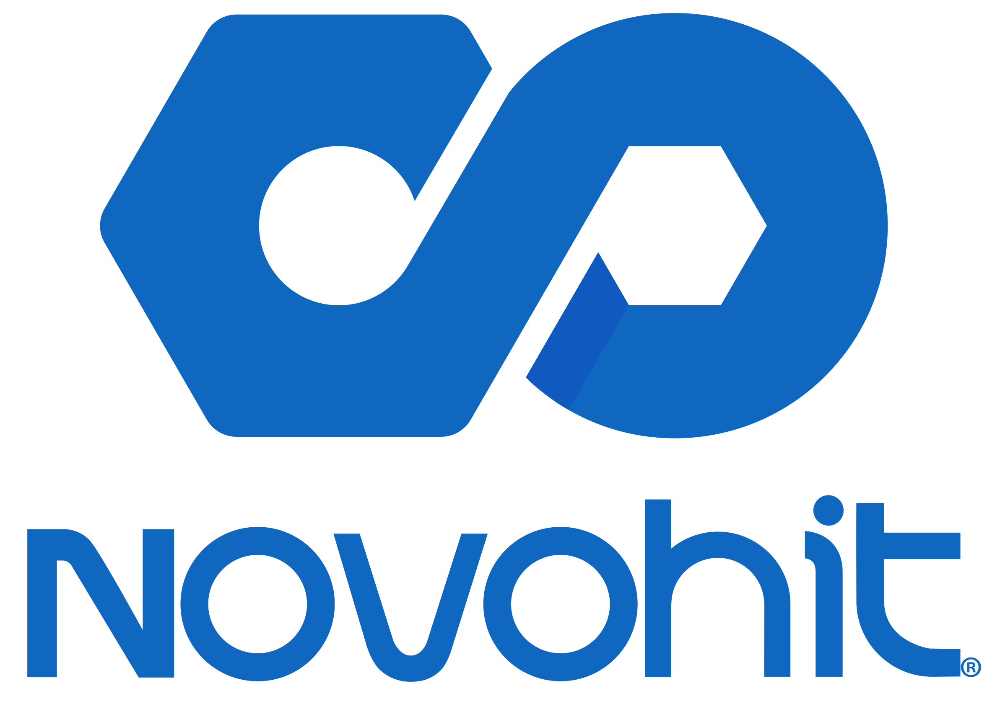
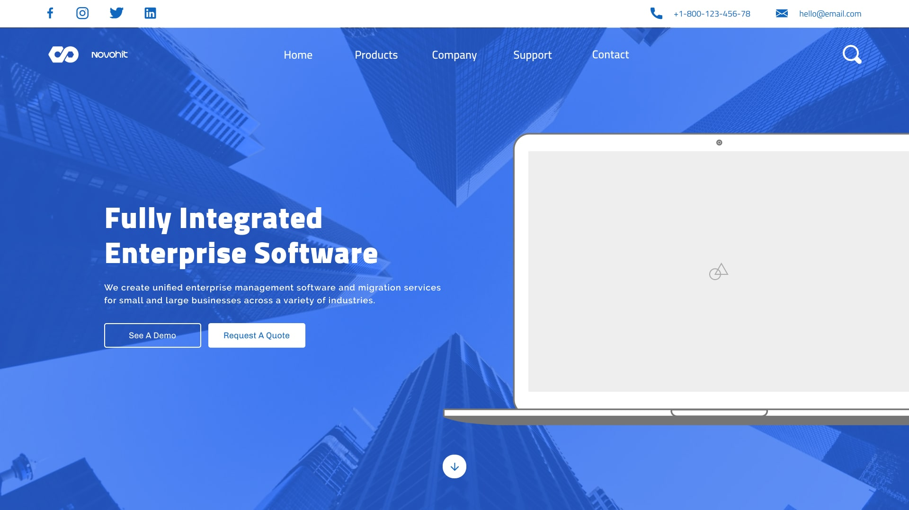
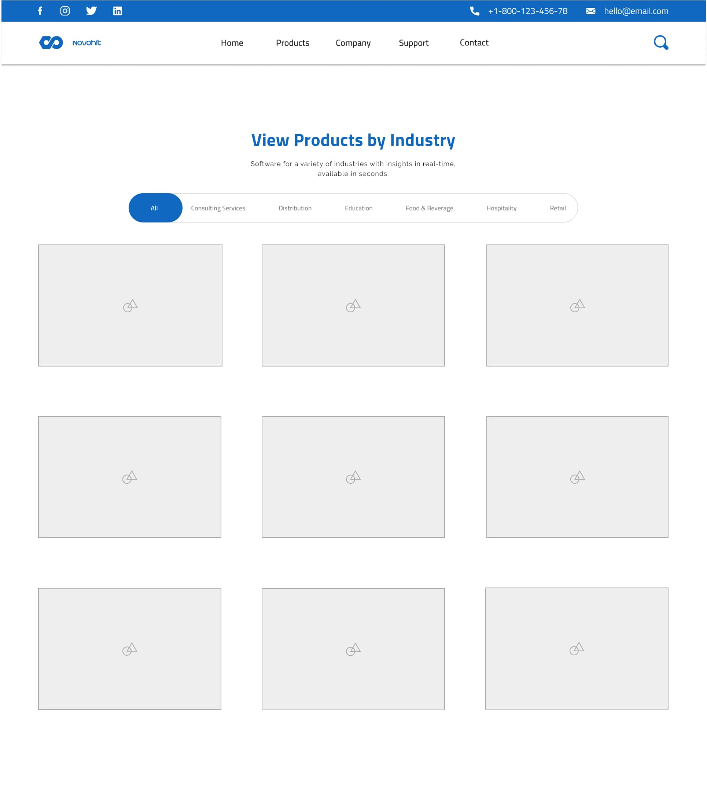

<!-- Heading -->

<h1>Novohit Website Redesign</h1>

A single-page website designed for Novohit using WordPress and Elementor.

<!-- Table of Contents -->

<ul>
    <li><a href="#live-demo">Live Demo</a></li>
    <li><a href="#overview">Overview</a></li>
    <li><a href="#features">Features</a></li>
    <li><a href="#outcomes">Outcomes</a></li>
    <li><a href="#technologies-used">Technologies Used</a></li>
    <li>
        <a href="#design-process">Design Process</a>
        <ul>
            <li><a href="#research">Research</a></li>
            <ul>
                <li><a href="#industry-analysis">Industry Analysis</a></li>
                <li><a href="#novohit-q-and-a">Novohit Q&A</a></li>
                <li><a href="#user-research-surveys">User Research (Surveys)</a></li>
                <li><a href="#user-research-personas">User Research (Personas)</a></li>
                <li><a href="#competitor-analysis">Competitor Analysis</a></li>
                <li><a href="#novohit-analysis">Novohit Analysis</a></li>
            </ul>
            <li>
                <a href="#plan">Plan</a>
                <ul>
                    <li><a href="#user-flow">User Flow</a></li>
                    <li><a href="#prototype-iteration-1">Prototype (Iteration 1)</a></li>
                    <li><a href="#prototype-iteration-2">Prototype (Iteration 2)</a></li>
                </ul>
            </li>
            <li>
                <a href="#create">Create</a>
                    <ul>
                        <li><a href="#landing-page">Landing Page</a></li>
                        <li><a href="#product-catalog">Product Catalog</a></li>
                        <li><a href="#company-services">Company Services</a></li>
                        <li><a href="#company-values">Company Values</a></li>
                        <li><a href="#footer">Footer</a></li>
                        <li><a href="#support-page">Support Page</a></li>
                        <li><a href="#contact-page">Contact Page</a></li>
                    </ul>
            </li>
        </ul>
        <li><a href="future-considerations">Future Considerations</a></li>
    </li>
</ul>

<!-- Live Demo -->

<h3 id="live-demo">🔍 Live Demo</h3>

<a href="https://www.novohit.com/" target="_blank">https://www.novohit.com/</a>

<blockquote><b>Note:</b> Some aspects of Novohit's website have changed since my collaboration with them over a year ago and may continue to change. The screenshots in this documentation are my own and were recorded during the project's development phase.</blockquote>

<!-- Overview -->

<h3 id="overview">📋 Overview</h3>

Novohit is a software management company developing Enterprise Resource Planning (ERP) solutions for a variety of businesses in the hospitality industry. Located in Santiago, Chile, the company contracted me to redesign their outdated website, align incoming brand changes with existing products, and help build a foundation for their entry into the United States market.

<!-- Features -->

<h3 id="features">✨ Features</h3>

<ul>
    <li>Automatic and manual language localization to serve pages to American, Mexican, and Chilean audiences</li>
    <li>Responsive styling for mobile, tablet, and desktop</li>
    <li>Product catalog with optional filtering</li>
    <li>Client scheduling system for in-person or virtual demos</li>
</ul>

<!-- Outcomes -->

<h3 id="Outcomes">📊 Outcomes</h3>

<ul>
    <li>Increased page impressions by +2,000/month and implemented website translation services for thousands of monthly visitors</li>
    <li>Designed modern accessibility features for 3,500 monthly mobile, tablet, and desktop users</li>
    <li>Leveraged Figma to create a scalable design system for Novohit’s website</li>
</ul>

<!-- Technologies -->

<h3 id="technologies-used">🧰 Technologies Used</h3>

     

<!-- Design Process -->

<h3 id="design-process">🧰 Design Process</h3>

<!-- Research -->

<h3 id="research">🔬 Research</h3>

<!-- Industry Analysis -->

<h4 id="industry-analysis">Industry Analysis</h4>

Since this was my first opportunity exploring the business space of ERP systems, I decided to do preliminary research before having an in-depth conversation with Novohit. Approaching the situation with pre-existing knowledge would create realistic expectations for the client and I moving forward.

I spent a week familiarizing myself with the <b>who</b>, the <b>what</b>, and the <b>why</b> of enterprise systems.

<ul>
    <li><b>Who</b> is it designed for?</li>
    <li><b>What</b> is ERP?</li>
    <li><b>Why</b> do companies use it? etc.</li>
</ul>

This information was pivotal during live discussions with Novohit's CEO regarding the design and user experience of their new website. Becoming well-versed in the company's roles, responsibilities, values, and expectations had helped me create a more meaningful experience for Novohit and its customers, and allowed me to embody professionalism as a UI/UX Developer.

<!-- Novohit Q&A -->

<h4 id="novohit-q-and-a">Novohit Q&A</h4>

Following my initial research, I prepared a Q&A discussion with Novohit to:

<ul>
    <li>Define the project's timeline</li>
    <li>Generate ideas for the website's design and user experience</li>
    <li>Learn more about the company's product and target audience</li>
</ul>

This was an introspective exercise to help me understand Novohit's vision and resolve development issues in hindsight. My primary concern was feature creep and I wanted to define a set of guidelines before getting started. While there were many important decisions during the development phase, I adopted future-proof design practices to coordinate with any priority shifts or newly generated ideas.

For instance, when the company asked me to update the website in its development stage to align with their administrative portal's recent design changes, I was able to easily apply variations and change global styles in just a few clicks. The decision to leverage Figma as my design program of choice allowed me to create a scalable design system, collaborative environment, and the flexibility to meet the company's needs.

<!-- User Research (Surveys) -->

<h4 id="user-research-surveys">User Research (Surveys)</h4>

The previously mentioned Q&A only revealed a partial understanding of Novohit's expectations as a company. I needed more feedback from customers and users themselves to understand how the company's audience felt about the Novohit website.

Working with limited resources, I drafted a Google Survey that introduced respondents to <b><a href="#sitemap-novohit-old">Novohit's old website</a></b> and asked them to answer a series of questions regarding their initial impressions. The feedback assisted us with making informed decisions about the proposed user experience and allowed Novohit to reflect on its customer impressions before moving forward.

<!-- User Research (Personas) -->

<h4 id="user-research-personas">User Research (Personas)</h4>

User stories and scenarios help UX developers better understand who users are and ensure that features have meaningful impact on audiences. The primary methods for representing users accurately include:

<ul>
    <li>Identifying information to develop user personas</li>
    <li>Observing users through usability studies to implement design patterns</li>
</ul>

I continued my research by drafting personas from the information gathered in my initial Q&A with Novohit. While the portraits in the below image are fictional, the information represented in each card is indicative of Novohit's existing clientele and incoming customers from the U.S. The conclusion drawn from this exercise helped us narrow down specific demographic needs and prepare the website to service English, Italian, and Spanish speaking audiences.

<!-- Competitor Analysis -->

<h4 id="competitor-analysis">Competitor Analysis</h4>

The final step in my research process was a rudimentary competitive analysis of existing ERP developers to see how others solve similar problems. My challenge was to create or adopt a solution for managing the plethora of information that hindered Novohit's antiquated website navigation. The company wanted a more fundamental method for organizing and presenting information to new and existing customers which we solved with a single-page application and <a href="#product-catalog"><b>product catalog</b></a>.

The below images represent an example my competitor research and include observations of SAP's method for creating user interfaces and navigational flow. I was able to draft my own sitemap for <a href="#sitemap-novohit-new"><b>organizing Novohit's services and products</b></a> into a digestible format that reflects the company's expertise.

<!-- Novohit Analysis -->

<h4 id="novohit-analysis">Novohit Analysis</h4>

Novohit's previous website was observed similar to the competitor analysis to identify user experience and interface pain points that could be improved upon or revised.

Novohit's previous sitemap.

Novohit's newly proposed sitemap for organization and information clarity.

<!-- Plan -->

<h3 id="plan">📅 Plan</h3>

<!-- User Flow (Proposal) -->

<h4 id="user-flow">User Flow</h4>

Following the project's research phase, it was time to focus on the user experience. My initial introspection with Novohit helped to identify two key objectives that influenced the proposal pictured below — to be accessible and approachable.

Novohit wanted more customer outreach to users on tablets and mobile phones, as well as a design that would assist new customers with finding a product for their specific use case. This would ensure existing clients could find the information they needed while helping new clients identify useful services that Novohit offers.

<blockquote><b>Note:</b> Some features, such as the "ERP Advisor", did not make it to production either due to time, priority, or financial constraints.</blockquote>

<!-- Prototype (Iteration 1) -->

<h4 id="prototype-iteration-1">Prototype (Iteration 1)</h4>

Pictured below is a comparison between the prototype and mockup designs of my proposed design for Novohit's new website. These designs would soon change in favor of a second, improved iteration that adopts a more traditional style.

    
    

<!-- Prototype (Iteration 2) -->

<h4 id="prototype-iteration-2">Prototype (Iteration 2)</h4>

The second prototype integrated Novohit's brand alterations with my previous design. It was necessary to update the website's color scheme to align with the new branding standards, and decisions were made to adopt a traditional top navigation bar. Below is a snippet of the second prototype's landing page and a preview of the <a href="#product-catalog"><b>product catalog</b></a> in its development phase.

The product catalog's design was largely influenced by the aforementioned planning phase as shown in the <a href="#card-layout"><b>card layout</b></a> below, emphasizing the application of usability research.

<!-- Create -->

<h3 id="create">✏️ Create</h3>

The final designs were transposed to WordPress using Elementor as a low-code editor. Some elements, such as the navigation bar and product catalog, were hard coded due to limitations with the platform's preset components.

While I'm unable to share snippets of code related to the final product, I plan to recreate the website as a personal project using React.js or Next.js in the near future. Below are screenshots from the live website which you can visit at <a href="https://www.novohit.com/" target="_blank"><b>https://www.novohit.com/</b></a>.

<h4 id="landing-page">Landing Page</h4>

<h4 id="product-catalog">Product Catalog</h4>

<h4 id="company-services">Company Services</h4>

<h4 id="company-values">Company Values</h4>

<h4 id="footer">Footer</h4>

<h4 id="support-page">Support Page</h4>

<h4 id="contact-page">Contact Page</h4>

<!-- Future Considerations -->

<h3 id="id="future-considerations"">💬 Future Considerations</h3>

At the time of writing this, it's been over a year since the project ended and there's an incredible amount of experience and technique I've improved upon that would drastically change my approach. My responsibility was to understand the project at all levels, learning and documenting the website’s general features, comprehending industry specific needs, and implementing information in a meaningful way to consider a variety of demographics — all while taking into consideration best practices such as: clean and reusable code, minimal dependency on third party libraries, modern usability patterns, and scalable designs.

I recently had a chance to speak to the CEO in-person and he shared how the project garnered new clients for Novohit and allowed them to build on the foundation I created for their website. He shared his appreciation for my ability to grasp project requirements on-the-go, even if they involved different skills, which is an advantage when creating projects with certain complexity. He also commended my attitude towards learning and maintaining a detail-oriented mindset which expressed itself in my work. 

Overall, I'm proud of my accomplishments as a UI/UX Developer delivering a product that helped Novohit break into a new market and hope to develop even greater experiences moving forward in my career.
